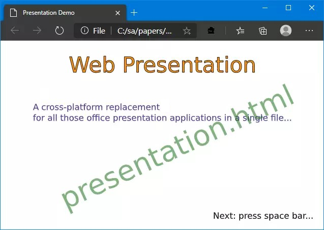

@numbering {
    enable: false
}

{title}Web Presentation, an Application in a Single File, now with Video

[*Sergey A Kryukov*](https://www.SAKryukov.org){.author}

A cross-platform replacement for all those office presentation applications in a single file

*Who needs presentations created with boring bulky office presentation packages not always available for all systems? All you need is a Web browser and a set of vector/pixel images. With a solution in just one HTML/CSS/JavaScript file, you have all the features people use in presentations. Since v.2, in addition to graphics and animated graphics, video elements can be added and controlled from the presentation frames.*

<!-- copy to CodeProject from here ------------------------------------------->

<ul class="download">
	<li><a href="Web-presentation.zip">Download source code file and demo &mdash; 11.2 MB</a></li>
	<li><a href="https://SAKryukov.github.io/web-presentation/demo">Live demo</a></li>
</ul>

(This demo uses one AV1 video, which is compatible with almost all browsers, but not Microsoft Edge)



## Contents{no-toc}

@toc

## Introduction

This article is the first article of the small series of articles on the Web presentation products:

- The present article
- [Web Presentation, the Other Way Around](https://www.codeproject.com/Articles/5290221/Web-Presentation-the-Other-Way-Around)

## Motivation

For the last presentation I delivered, I already had a collection of SVG images mostly representing some architectural solutions. When you develop architectural and design solutions, you always have some, as SVG is the most universal vector format. While photos can be easily shown in a presentation manner using a suitable image viewer, SVG typically takes some extra effort, and probably the worst option would be messing with those office presentation applications. Why not showing the images themselves? After all, they are scalable and compatible with all non-nonsense Web browsers.

So I quickly put together the images in a JavaScript file and added the simplest script used to move from one image to another. What a relief! Who would ever need anything else?

In the demo, I added some animated SVG, static WebP photographs, and a WebP video converted from an out-of-camera video in the form of WebP animation, and, in a later version, also a real WebM video sample. These files and the features have nothing to do with the presentation product itself, they just demonstrate that all we need is already available, can be created using open-source products only. At the same time, we can have all the features expected from those bloated office software applications, in a much easier way.

## Usage

The basic usage is probably as simple as it can be. The [live demo](https://SAKryukov.github.io/web-presentation/demo) also provides an introduction to the presentation system and shows its features.

Basically, the presenter creates a set of files each representing a presentation frame, lists their paths in required order in a presentation data file, and loads "presentation.h" in a browser, passing the presentation data file in the URL query string. Presentation starts.

There is also some minimal set of advanced properties; each of them is optional.

### Presentation Data

In addition to image files, the presentation needs to be described. First of all, it needs a list of relative paths to image file, to define both image data and the order of images in the presentation. All other properties can be omitted, then the default values are used. For example, let's assume we put it in a file "demo/presentation.js", path is relative to "presentation.html":

```{lang=JavaScript}{#presentation-sample}
const presentation = {
    images: [ // relative to presentation.html
        "demo/1.webp",
        "demo/1.svg",
        "demo/2.webp",
    ],
    title: "Presentation Demo",
    hideHelpOnStart: false,
    colors: {
        background: "white",
        text: {
            background: "azure",
            foreground: "black",
            border: "lightBlue",
        },
    },
    rtl: false,
};
```

The extended syntax since v.&thinsp;2 allows for adding of the video elements in the list. Here is the example:

```{lang=JavaScript}
const presentation = {
    images: [ // relative to presentation.html
        "demo/1.webp",
        image("demo/1.svg"), // same as "demo/1.svg"
        video("demo/myClip.webm", {
            title: "My concert",
            poster: "demo/our-concert-hall.webp"
        }),
        video("demo/myTrip.webm", {
            title: "On the road",
            play: true, // auto-play
        }),
    ],
}
```

This way, the list of the presentation frames can be polymorphic, a sequential mixture of the image and video elements. See the [video properties below](##heading-video-properties).

This presentation can be loaded on a Web page by using the path to the presentation file in a query string of the URL. The easiest way to do it is to have a separate presentation-specific HTML file. Let's assume this is the file "demo/index.html", then its content could be:

```{lang=HTML}{#presentation-index-sample}
&lt;!doctype HTML&gt;
&lt;html&gt;
    &lt;head&gt;
        &lt;meta http-equiv="refresh" content="0; url=
        ../presentation.html?demo/presentation.js" /&gt;
    &lt;/head&gt;
&lt;/html&gt;
```

### Presentation Properties

All paths are relative to the location of "presentation.html".

`presentation.images`: an array of image file names, paths are relative to "presentation.html". This property is the only mandatory one. If it is missing, or this is an empty list, the application will report an error.

Optional Properties:

`title`: presentation title

`hideHelpOnStart`: boolean (true/false), default: `false`, that is, by default help text is shown on started.

`colors`: colors for the presentation background and rendering of text data.

`colors.background`: presentation background. It is also applied as a background for all images supporting transparency or alpha channel.

`colors.text`: colors for the rendering of text data, an object with three self-explained properties.

`rtl`: the option for [right-to-left cultures](https://en.wikipedia.org/wiki/Right-to-left), explained in detail [below](#heading-rtl-support), default: `false`.

### Video Properties

Each video element is added in the form

```{lang=JavaScript}
video("path_to_video_source_file", // relative to presentation.html
    { /* video properties... */ } // optional
)
```
Properties:

`title`: String, the title of the `<video>` element.

`poster`: String, the path to the raster graphics file shown as the poster over the video element before the video starts.

`play`: `true`/`false`: auto play; if it is `true`, the video starts to play when its presentation frame becomes active.

Note that using both `poster` and `play` at the same time makes little sense because if the video is started to play automatically, the spectators won't have enough time to see the poster.

### Image File Types

For the presentation frames, all MIME types standardized for Web are acceptable. For vector graphics this is [SVG](https://en.wikipedia.org/wiki/Scalable_Vector_Graphics), image/svg+xml. For raster graphics and acceptable types are: image/apng, image/avif, image/gif, image/jpeg, image/png and image/webp.

Image file types accepted by specific browser but not standardized for Web, such as .bmp, .ico, or .tif, should be best avoided.

For raster images, the most practical and recommended format is [WebP](https://en.wikipedia.org/wiki/WebP). It provides much better compression than older image types, supports progressive rendering, separate presets optimized for Picture, Icon, Photo, Drawing, and Text, and animation. Other animation-supporting types for raster graphics are [APNG](https://en.wikipedia.org/wiki/APNG), [AVIF](https://en.wikipedia.org/wiki/AV1#AV1_Image_File_Format_(AVIF)), and [GIF](https://en.wikipedia.org/wiki/GIF).

However, for presentation purposes, the most important type of animation is vector animation, SVG, because people widely use various transition effects. Even though such effects more distract from the presentation than help to understand the material, they are considered as a must.

## Animation

Even though the creation of the image files is the sole responsibility of the user, I just want to comment on the creation of animation, using only the image file types standardized for Web and only open-source products and standards. There are many tools for the creation of the animation.

For example, SVG can be created using [Inkscape](https://en.wikipedia.org/wiki/Inkscape). There is a lot of documentation on SVG animation, first of all, [SMIL](https://en.wikipedia.org/wiki/SVG_animation#SVG_animation_using_SMIL), which is probably the most suitable approach for presentation purposes: each transition effect takes just one short line of XML code, and the effects can be combined on the same element. Also, some add-ons for animation are available.

For raster graphics, the best approach is probably WebP. I used two tools for the creation of animation. First of all, the animation can be composed of a set of separate frames in [GIMP](https://en.wikipedia.org/wiki/GIMP). To do so, one needs to put each frame in a separate layer, perform animation optimization ([Main menu] => Filters => Animation => Optimize (Difference)), and save the result in a WebP image. At the moment of saving, GIMP will offer an option to create an animation.

Also, [FFMpeg](https://en.wikipedia.org/wiki/FFmpeg) can convert available video file to a WebP animation. The example of a command line:
```
ffmpeg -i input_file -vcodec libwebp -filter:v fps=fps=20 -lossless 0 -compression_level 6 -an -vsync 0 output_file.webp
```
See FFMpeg documentation for more detail.

All the software tools I mentioned are not only open-source but also available on most platforms.

## Implementation Detail

The implementation is trivial enough to get into detail too much. The purpose of this article is to provide a comprehensive working tool for presentations, not so much to teach anything. If this work can teach something, it's the taste for minimalism and sober practical look at all those commercial bloated products.

So, I'll touch only a few not-so-obvious aspects.

### Preserved Animation

Animation is preserved by not loading all images during the initialization phase. Instead, there is only one `img` element which is loaded from source by assignment to its `src` property only for the very first image of the presentation. All other images are loaded as the are shown:

```{lang=JavaScript}{#code-move}
const move = backward => {
    // ...
    // undefined: initialization, boolean: backward/forward:
    if (backward != undefined) {
        if (backward)
            if (current > 0) --current; else current = presentation.images.length - 1;
        else
            if (current < presentation.images.length - 1) ++current; else current = 0;
    image.src = presentation.images[current];
    // ...
    if (isVideo) {
        // ...
        videoSource.src = item.source;
        // ...
    } else {
        image.src = item;
        resize(image);
    }
    show(video, isVideo);
    show(image, !isVideo);
};
```
This way, each `image.src` property assignment starts the animation. Accordingly, the animation is started again every time the same image is shown. After the video capability feature has been added in v.&thinsp;2, `` and `<video>` elements are shown/hidden, depending on the type of the current element in the `images` list. In contrast to graphics animation, video is started either by explicit user command (key "P", Play/Pause) or automatically, when the frame with the video becomes active &mdash; this is controlled by the video boolean property `play`, optionally found in the image list.

### Loading, Starting, Pausing, and Stopping Video

There are several confusing parts of the video API, so I want to make some useful notes on it.

I have to start from the aspects required by the design. There could be a clash between the navigation inside of a video and the "outer" navigation of the presentation frames. I decided to resolve it in the following design: let's consider the &larr; and &rarr; keys dedicated to the presentation frame navigation. Jumping between the location withing a video is rarely needed during the presentation, but even if it is needed, mouse/touchscreen/touchpad can be used. Additionally, I dedicate the key "P" for video Play/Pause. When the video has played to the end, it also works as the video restarts, because this is how the call to `HTMLVideoElement.play()` works.

Now, when an active frame needs to load a video, a previously shown video or graphics image should be unloaded. In contrast to the `img` element, assignment a string value to the property `HTMLSourceElement.src` is not enough; also `HTMLVideoElement.load()` should be called.

All of this is taken into consideration here:

```{lang=JavaScript}
const move = backward => {
    video.pause();
    document.exitFullscreen();
    videoSource.src = undefined;
    image.src = undefined;
    // ...
    if (isVideo) {
        if (item.source) {
            video.poster = item.poster;
            video.title = item.title;
            videoSource.src = item.source;
            video.onplay = event => event.target.requestFullscreen();
            video.onended = event => document.exitFullscreen();
            video.load();
            if (item.play)
                video.play();
        } else
            video.title = "Video file not specified";
    } else {
        image.src = item;
        resize(image);
    } //if
    // ...
}
```

```{lang=JavaScript}
document.body.onkeydown = event => {
    switch (event.code) {
        // ...
        case "KeyP":
            if (videoSource.src)
                if (video.paused) video.play(); else video.pause();
    }
};
```

I would say, most confusing part here is `document.exitFullscreen()`. I use the fullscreen API to show video in fullscreen when it is started, and naturally, we need the previous mode to be restored when the active presentation frame is changed. But what happens if the user also uses the browser's fullscreen mode?  Surprisingly, nothing wrong. Despite the function name, `document.exitFullscreen()` will render the same browser's fullscreen or window mode as before playing of the video. Video fullscreen and browser window fullscreen are different things and do not clash.

### Touchscreen Support

```{lang=JavaScript}{#code-touch}
let touchStart = undefined;
addEventListener("touchstart", event => {
    touchStart = { x: event.changedTouches[0].clientX,
                   y: event.changedTouches[0].clientY };
}, false);
addEventListener("touchend", event => { touchStart = undefined; }, false);
addEventListener("touchmove", event => {
    if (touchStart == undefined) return;
    const vector = { x: event.changedTouches[0].clientX - touchStart.x,
                    y: event.changedTouches[0].clientY - touchStart.y };
    const horizontal = Math.abs(vector.x) > Math.abs(vector.y);
    let back = horizontal ? vector.x > 0 : vector.y > 0;
    if (horizontal && presentation.rtl) back = !back;
    move(back);
    touchStart = undefined;
}, false);
```
This behavior also depends on the `presentation.rtl` property explained below.

### RTL Support

Written writing cultures based on the [right-to-left](https://en.wikipedia.org/wiki/Right-to-left) system also slightly modify the views of people. This cultural element can affect the way some people look at the [arrow of time](https://en.wikipedia.org/wiki/Arrow_of_time): while in Western cultures people imagine time as something floating from left to right, other people may think otherwise. In this case, it can be more natural to view the flow of the presentation as something moving from right to left. For such people, the `rtl` property is provided. It only changes the use of left/right arrows and left/right swipe with a touchscreen: the direction changed to is opposite. It has nothing to do with [CSS direction](https://developer.mozilla.org/en-US/docs/Web/CSS/direction) but is based on similar considerations.

Effectively, it only affects how people treat arrow keys "&larr;" and "&rarr;" and the direction of the touchscreen swipe. In Western cultures it is implied that "&larr;" means "previous" and "&rarr;" means "next", a person performing these operations imagines a current frame as a window, showing a strip of frames, representing the timeline. For touch screen swipe, a person "moves" not a window, but a strip of frames itself, so "&larr;" means "next" and "&rarr;" means "previous". In RTL cultures, all four operations come in opposite directions. At the same time, the meaning of up and down directions doesn't depend on the culture.

Therefore, as the function `move` accepts a boolean parameter with the meaning of "go to previous frame", the handling of arrow keys depends on the `presentation.rtl`, but only for horizontal directions:

```{lang=JavaScript}{#code-keyboard}
switch (event.code) {
    case "Space":
    case "ArrowDown": move(false); break;
    case "Backspace":
    case "ArrowUp": move(true); break;
    case "ArrowRight": move(presentation.rtl); break;
    case "ArrowLeft": move(!presentation.rtl); break;
    //...
}
```

Similarly, the direction in reverse is used for horizontal directions only in the implementation of the [touchscreen swipe](##heading-touchscreen-support) gestures.

### Releases

#### 1.1.0

November 22, 2020

First production release, supports only media compatible with the `` element: vector/raster graphics, and animated vector/raster graphics.

#### 2.1.0

November 24, 2020

Video-ready release. In addition to images, a video can be added. The syntax of the media list is extended to embrace a polymorphic list of a mixture of graphics and video elements, while original syntax is preserved.

#### 3.0.0

December 6, 2020

Style improvements for video. In response to feature requests (CodeProject member [gunamoi1](https://www.codeproject.com/Members/gunamoi1)), the video element is always centered or in the fullscreen mode.

#### 4.0.0

December 21, 2020

Minor fixes. In this release, an alternative product has been added, under the nickname "the other way around". It is described in a [separate article](https://www.codeproject.com/Articles/5290221/Web-Presentation-the-Other-Way-Around).

#### 4.2.0

January 12, 2021

The help element close box replaced with platform-independent SVG

#### 4.3.0

January 17, 2021

Fixed close box size problem manifested with Gecko and Goanna engines.

#### 4.4.0

September 4, 2023

Fixed typo in both Presentation products

## Credits

[Nelek](https://www.codeproject.com/script/Membership/View.aspx?mid=2965702) found [a typo](https://www.codeproject.com/Messages/5960015/Re-Power-Point) in both Presentation products. Fixed in v.&thinsp;4.4.0

## License Note

All photo, video, and graphics materials used in the demo are created by the [author of this article](https://www.codeproject.com/Members/SAKryukov) and protected by the license referenced below.
