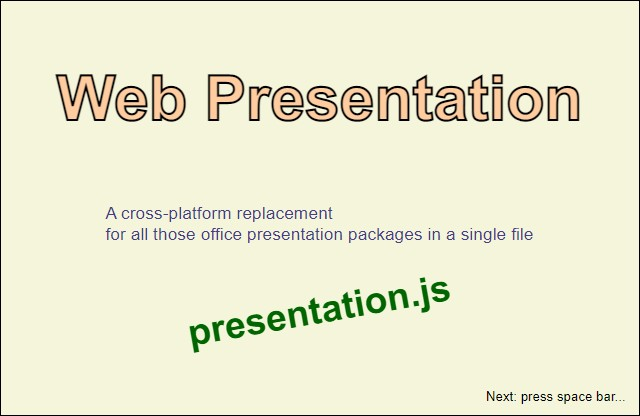

@numbering {
    enable: false
}

{title}Web Presentation, the Other Way Around

[*Sergey A Kryukov*](https://www.SAKryukov.org){.author}

Another variant of the cross-platform replacement for all those office presentation applications in a single file, and now this file is JavaScript

In a new variant of the Web Presentation product, the user defines the presentation data in some HTML file. It's just a bit more complicated than the approach when user data is defined in a JavaScript file. But new benefits are: 1) A new type of presentation frame is introduced: user-defined HTML. 2) For people knowledgeable in HTML and CSS,  feature-rich animated HTML is simpler than animated vector graphics. 3) The author of the presentation gets comprehensive data validation.

<!-- copy to CodeProject from here ------------------------------------------->

<ul class="download">
	<li><a href="Web-presentation.zip">Download source code file and demo &mdash; 11.2 MB</a></li>
	<li><a href="http://www.sakryukov.org/software/GitHub.live/web-presentation/demo">Live demo</a></li>
</ul>

(This demo uses one AV1 video, which is compatible with almost all browsers, but not Microsoft Edge)



## Contents{no-toc}

@toc

## Why Another Variant?

This is a second article on the topic of Web Presentation in a single file:

- [Web Presentation, an Application in a Single File, now with Video](https://www.codeproject.com/Articles/5286790/Web-Presentation-an-Application-in-a-Single-File)
- The present article

Initially, a CodeProject member [Helena Munzarova](https://www.codeproject.com/script/Membership/View.aspx?mid=11286055) have read my [first article](https://www.codeproject.com/Articles/5286790/Web-Presentation-an-Application-in-a-Single-File) and suggested a different approach. We had a detailed discussion. The approach she suggested was to provide a solution in a single JavaScript file, not an HTML file, as in my first solution. In this case, the user has to provide the presentation data in an HTML file.

My concern was that writing a presentation in the form of HTML would require much more knowledge from the users. Nevertheless, during the discussion, I found a way to design the solution keeping it extremely simple for the user, the presentation author. At the same time, knowledgeable users can use advanced HTML and CSS features and design more efficient, appealing, and maintainable presentation frames in a single HTML document. For [Helena](https://www.codeproject.com/script/Membership/View.aspx?mid=11286055), the main benefit was adding a third type of the presentation frame: HTML. Two first types are graphics and video supplied by the user in separate files, but HTML should be developed by the user in the same presentation files, each frame represented by a separate HTML element and its `innerHTML`, and I found it easy enough to implement.

But for me, a more important benefit of this "the other way around" approach is the [validation of the user data](#heading-presentation-data-validation).

By the way, the image on top of this article and four new highly animated presentation frames in my demo are HTML frames.

## Usage

### Simplest Presentation

Let's take a look at the presentation sample "demo-the-other-way-around/minimal.html":

```{lang=HTML}
&lt;html&gt;
    &lt;head&gt;
        &lt;script src="../presentation.js"&gt;&lt;/script&gt;
        &lt;title&gt;Minimal Presentation Demo&lt;/title&gt;
    &lt;/head&gt;
&lt;body&gt;
    "../demo-resources/2007-06-23.panorama.webp"
    "../demo-resources/2019-05-18.088.webp"
    "../demo-resources/2020-09-17.video.32.webp"
&lt;/body&gt;
&lt;/html&gt;
```

This simplest form of the presentation is good only for a limited type of presentation: the sequence of image files, without video or user-defined HTML frames. The author of the presentation will need to add extra elements and list some files in the text content of some other elements, not `body`, but in the exact same way. First, we need to clarify how a file list should be formatted.

### File Name Separators

The sample of the presentation shown above suggests that the image files should be entered enclosed in double quotation marks. They are also separated with blank spaces and text line separators, but these characters are simply ignored (unless they are included in a file name) and are not required. Another allowed separator is colon "`:`". Both separators can be used in the same file. The use of the separator is dictated by the following rules:

1. The text content is trimmed; if the trimmed string is empty, it is considered as an empty array of files.

1. If the first character in the trimmed non-empty string is the primary separator `"`, this character is used as an effective separator, otherwise, the effective separator is the secondary separator "`:`".

1. The entire text string is split using the effective separator. Every fragment of the split is trimmed and ignored if empty, otherwise, it is added to the list of the file names.

Naturally, both forms allow the file names with space characters inside. If a file name contains one of the separator characters, another one should be used as a separator.

Recommendation: the best idea is avoiding the use of any separator characters in file names. I would even not recommend blank space characters in file names. Everything will work with this particular application, but with many other applications, this is a source of inconveniences.

Perhaps I have to explain why the rules use two separators. First of all, in Windows, the double quotation mark is not a valid character for file names, but the colon is used in the special cases we all know. Using colon as a part of a file name makes little practical sense, but still, a user can enter such names using double quotation marks. These marks are also usually used for entering file names with some blank characters inside.

For [*NIX](https://en.wikipedia.org/wiki/Unix-like), including Linux, only null characters and "`/`" are special; all other characters can be used in a file name. Nevertheless, different applications may make it difficult to enter the names with colon or double quotation marks, as these characters are used for different special purposes, pretty much in the same way as in Windows. At the same time, the colon is a usual "path separator" in *NIX configuration, shell, and other files.

The set of more than one files are used in two cases: to prescribe a list of image files in a single HTML node, or to specify a video file name with the corresponding poster file name. The use of video will be [explained in detail below](#heading-video-options).

### Presentation with Frames of Different types

The simplest example shown above is just a shortcut good only for the presentations composed only of the image files, vector, or raster graphics. As there are two more presentation frame types, video, and HTML, we need a way to indicate the type. For this purpose, the data is entered not in the text content of the `body`, but in separate elements, immediate children of the `body` element. If at least one element is used in the `body` element, its text content is ignored.

To define an element describing a frame, any element can be used. As a matter of fact, even the tags name not at all defined by the HTML standard do work; however, I would not rely on that. In all my demo and samples, I use the element `<i>`, because this is the shortest name that can be associated with the notions like "image", "item" or "input data".

Let's start with some simple example:

```{lang=HTML}
&lt;!-- ... --&gt;

&lt;body&gt;

&lt;!-- ... --&gt;

&lt;i class="image"&gt;single-vector-graphic-file.svg&lt;/i&gt;
&lt;i class="image"&gt;"image.0.webp" "vector.1.svg"&lt;/i&gt;
&lt;i class="image"&gt;vector.10.svg : vector.11.svg&lt;/i&gt;
&lt;i class="video" title="My trip"&gt;my-video-file.webm : a-poster-for-my-video.webp&lt;/i&gt;
&lt;i class="html"&gt;
    &lt;h1&gt;Some HTML Content:&lt;h1&gt;
    &lt;p&gt;Some paragraph&lt;p&gt;
&lt;/i&gt;

&lt;/body&gt;
&lt;/html&gt;
```

Here, to define the type of a presentation frame, the attribute `class` is used. In this context, it has nothing to do with CSS. It is used because it is a [global attribute](https://developer.mozilla.org/en-US/docs/Web/HTML/Global_attributes) and its name suggests the notion of classification, related to the notion of "type". Besides, two classes can be combined in a single attribute value.

For an element defining an image frame, the text content of the element should define one file or a list of files. For video, there must be a single video file or a list of two files, as explained in the [video options section](#heading-video-options).

For the HTML type, the `innerHTML` of the frame element is shown when the corresponding frame is shown during the presentation. The parent element for this content is `<main>`. Naturally, a user can provide a stylesheet applicable to all the HTML frames.

There are three presentation frame types: image, video, and HTML. Correspondently, there are three classes: `image`, `video`, `html`, and one additional class `autostart` which is used only in combination with `video`, for example:

```{lang=HTML}

&lt;i class="video autostart"&gt;&lt;!-- ... --&gt;&lt;/i&gt;

&lt;!-- same as: --&gt;

&lt;i class="autostart video"&gt;&lt;!-- ... --&gt;&lt;/i&gt;
```
Autostart is one of the video options. All video options are described below.

### Video Options

Video has only three options: 1) it can be auto-started when its presentation frame (not to mix up with video frames) is activated, 2) it can come with a poster image, 3) it can have a title shown when a mouse pointer hovers over the `<video>` element. By default, there is no autostart, and neither poster nor title is not shown. The following sample is self-explaining:

```{lang=HTML}
&lt;!-- ... --&gt;

&lt;body&gt;

&lt;!-- ... --&gt;

&lt;i class="video" title="My trip"&gt;my-video-file.webm : a-poster-for-my-video.webp&lt;/i&gt;
&lt;i class="html"&gt;&lt;h1&gt;Demonstration of video auto-start...&lt;h1&gt;&lt;/i&gt;
&lt;i class="video autostart" title="My trip"&gt;my-video-file.webm&lt;/i&gt; &lt;!-- no need for a poster --&gt;

&lt;/body&gt;
&lt;/html&gt;
```

Here, the element defining a video frame should specify one or two files; the first file is always a video file, and the optional second file is always a poster image file.

The attribute `title` and its value are collected from the user data and used for the `<video>` element.

### Presentation Options

The presentation options are prescribed in a `<select>` element:

```{lang=HTML}
&lt;!-- ... --&gt;

&lt;body&gt;

&lt;!-- ... --&gt;
&lt;select&gt;
    &lt;option value="false"&gt;hideHelpOnStart&lt;/option&gt;
    &lt;option value="white"&gt;background&lt;/option&gt;
    &lt;option value="false"&gt;rtl&lt;/option&gt;
&lt;/select&gt;

&lt;/body&gt;
&lt;/html&gt;
```
The definitions shown in this sample are defaults. The name is represented by the text content of an `<option>`, and the value --- by its `value` attribute. Any of these options can be omitted, we well as the `<select>` element, then the default values are used. as the value of the last relevant line defines the effective option value. There should be no more than one `<select>` element in the file, an immediate child element of the `body`.

The application of the video options is [described in the previous article](https://www.codeproject.com/Articles/5286790/Web-Presentation-an-Application-in-a-Single-File#heading-video-properties).

### Recommendation for HTML Content Authoring

Presentation is a document very different from different types of documents. While other document types require freely floating HTML content, presentation requires that content fits well on a single page.

For styling of the HTML frames, it's important to remember that the content of each HTML frame becomes the `innerHTML` of a single `<main>` element. Even though the presentation author can change the styles of any other element, including `<body>`, I would recommend changing the style of `main` and any the elements of each HTML presentation frame content. At the same time, sometimes it would be useful to change the background color of `body` because it would define the background color of all the HTML frames, and for other frames, the color defined by the [option "background"](#heading-presentation-options) is used.

For simplicity, I would also recommend one simple technique: for each HTML presentation frame, create a single block element (such as `<section>`) with a unique `id` attribute value. All other frame content can be the nested content of this element. This way, CSS use a separate [ID selector](https://developer.mozilla.org/en-US/docs/Web/CSS/ID_selectors) or each of such section elements, and [descendant combinators](https://developer.mozilla.org/en-US/docs/Web/CSS/Descendant_combinator) or [child combinators](https://developer.mozilla.org/en-US/docs/Web/CSS/Child_combinator) for all the nested content. This technique will easily eliminate any mess in the styles of similar elements.

Fitting the page area with an HTML frame content takes more advanced styling than the usual styling. I would advise considering the `flex` `display` and wide use of [relative units based on the viewport sizes](https://developer.mozilla.org/en-US/docs/Learn/CSS/Building_blocks/Values_and_units): `vw`, `vh`, `vmin` or `vmax`.

You can find many techniques in "demo-the-other-way-around/index.html". It doesn't mean that you should show all the animation techniques I do. Just the opposite: better try to minimize the use of animations almost everywhere or use no animation at all. I do all those animations because of the subject of my demo, a need to show many possibilities. For the presentations on other topics, the best style would be some combination of vector graphics with some nicely-formatted text, without excessive decorations.

## Implementation Detail

The major part of the implementation is built in a way very similar to that of "presentation.html". The move between the presentation frames is a bit different, because of the user-defined HTML frame option and the need to [preserve styles](##heading-preserving-styles).

And, naturally, the method of collection of the user-defined presentation data is different. Let's see.

### Collecting Presentation Data

The elements representing the presentation frames are collected using the selector `body > *:not(select)`. If there are no such elements, it can be a special case when there are only image-type frames defined in the text content of the `body` element. In both cases, a list `frameElements` is obtained:

```{lang=JavaScript}
const presentationFrameParser = selector => {
// ...
    let frameElements = document.querySelectorAll(selector);
        if (frameElements.length &lt; 1) { //the fake content
            const fakeElement =
                document.createElement(frameTypeElement.fakeContent);
            fakeElement.textContent = document.body.textContent;
            frameElements = [fakeElement];
        } //fake content
}; //

// ...

const frames = presentationFrameParser("body > *:not(select)");
```
The list of elements is then processed by `presentationFrameParser` to extract and [validate](#heading-presentation-data-validation) the presentation frame data.

Likewise, options are parsed and [validated](#heading-presentation-data-validation) using the selector for the `<select>` elements:

```{lang=JavaScript}
const options = optionParser("body > select");
```

### Presentation Data Validation

The major benefit of "the other way around" approach is that all mistakes the user can make are in HTML. And with HTML... there are no errors. Any wrong content is a subject of _[graceful degradation](https://en.wikipedia.org/wiki/Fault_tolerance)_. It provides a good opportunity to analyze the validity of the user data as it is collected.

All the analysis is performed by the functions `optionParser` and `presentationFrameParser`. If validation fails, each of the functions immediately returns a string value describing the error. If all validations pass to the very end of the parsing, the functions return frame and option data objects. This way, further processing is based on the type checking of the result returned:

```{lang=JavaScript}
const optionParser = selector => {

    // ...

    // Options data:
    const options = optionDefaults;
    const select = document.querySelectorAll(selector);
    // modify options using select data

    // ...

};

window.onload = () => {

// ...

// Frame data:
const frames = [];
const frames = presentationFrameParser("body > *:not(select)");
// Option data:
const options = optionParser("body > select");

// populate frames using frameElements

// ...

    if (frames.constructor == String)
        return textUtility.showError(frames);
    if (options.constructor == String)
        return textUtility.showError(options);

// ...

// presentation starts here:
initializeViewer(/* ... */)

});
```

This way, on the first user error, the user gets detailed diagnostics helping to fix the first problem encountered. In this case, the presentation does not start. It makes the elimination of all potentially puzzling mistakes extremely easy.

For example, the validation checks up that each `class` attribute defines one of the required classes or the combination of "video" and "autostart", that at least one file is specified for all elements defining a presentation frame or a set of frames, that each element of the `video` class defines more or two files, that the `<select>` element is only one or missing, and so on.

### Preserving Styles

As I expected, the most serious problem in this approach is rooted in the fact that the user, a presentation creator, can use HTML frames and can introduce any stylesheet. Before I introduce the HTML presentation frame option, it did not matter, because the styles of all HTML elements were controlled by the product code.

Hiding elements needed for the application frames requires the use of the style property `display` with the value `none`. When the element has to be shown, what value of the `display` property should be assigned. Before I introduced the HTML frame feature, it always was `block`, quite suitable for both `` and `<video>` elements. For arbitrary HTML content, it makes no sense, because the user can use any other `display` value for the top HTML element used for the presentation frame. For example, for the layouts specific for presentations, `flex` is particularly useful. Of course, the initial style of this element can be detected on the `load` of the `window` content, but this is not a reasonable complication. Instead, now the frame element is inserted into the list of `body` children and removed when it is no longer needed:

```{lang=JavaScript}
const move = backward =&gt; {
    // backward == true =&gt; previous frame
    // backward == false =&gt; next frame
    // else =&gt; initialization (undefined passed)
    // ...
    if (currentFrameElement)
        document.body.removeChild(currentFrameElement);
    currentFrameElement = item.type == frameType.video ?
        video : (item.type == frameType.image ? image : html);
    document.body.insertBefore(
        currentFrameElement,
        document.body.firstElementChild);
};
```

It is inserted and not appended for the following reason: another `body` child is the element showing help items. This element has `position: absolute`, and it can clash with any other `absolute`-positioned element introduced by the user. (A possible alternative solution would be using the CSS `z-index` property.)

In principle, the user can devise some stylesheet that can break styling required for the presentation of other types of presentation frames. To prevent it, the critically important styles for `document.body` and the help element are preserved. For `document.body`, they are restored every time a new presentation frame is displayed.

### Releases

#### 4.0.0

December 20, 2020

This is the first version following v.&thinsp;3.0.0 and the first version with "presentation.js", "the other way around".

## Credits

I am grateful to [Helena Munzarova](https://www.codeproject.com/script/Membership/View.aspx?mid=11286055) for the discussion in the comments to [my previous article](https://www.codeproject.com/Articles/5286790/Web-Presentation) and her idea, which inspired me to write the present work.
 
## License Note

All photo, video, and graphics materials used in the demo are created by the [author of this article](https://www.codeproject.com/Members/SAKryukov) and protected by the license referenced below.
