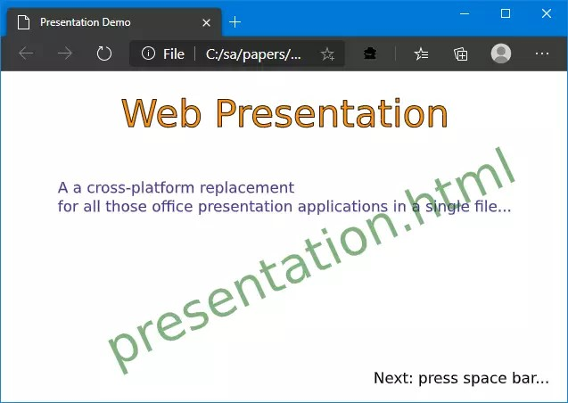

@numbering {
    enable: false
}

{title}Web Presentation, the Other Way Around

[*Sergey A Kryukov*](https://www.SAKryukov.org){.author}

Another variant of the cross-platform replacement for all those office presentation applications in a single file, and now this file is JavaScript

*???*

<!-- copy to CodeProject from here ------------------------------------------->

<ul class="download">
	<li><a href="Web-presentation.zip">Download source code file and demo &mdash; 11.7 MB</a></li>
	<li><a href="http://www.sakryukov.org/software/GitHub.live/web-presentation/demo">Live demo</a></li>
</ul>

(This demo uses one AV1 video, which is compatible with almost all browsers, but not Microsoft Edge)

## Contents{no-toc}

@toc

## Why Another Variant?

This is a second article on the topic of Web Presentation in a single file:
- [Web Presentation, the Other Way Around](https://www.codeproject.com/Articles/5286790/Web-Presentation-an-Application-in-a-Single-File)
- This article

Initially, a CodeProject member [Helena Munzarova](https://www.codeproject.com/script/Membership/View.aspx?mid=11286055) suggested another a different approach to , 

## Motivation

